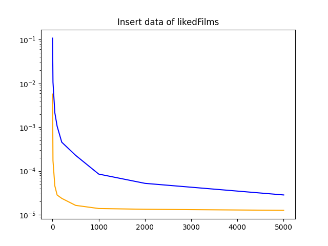

# Проверка хранилища

Для запуска тестирования скорости чтения и записи в хранилищах необходимо выполнить команды:
```
docker-compose -f mongo/docker-compose.yml up  --build -d
docker-compose -f clickhouse/docker-compose.yml up  --build -d
pip install -r requirements.txt
python -m data_storage_research
```

Результат представлен на графиках (синим цветом изображены результаты тестирования ClickHouse, оранжевым - MongoDB):



Чтение из БД:

